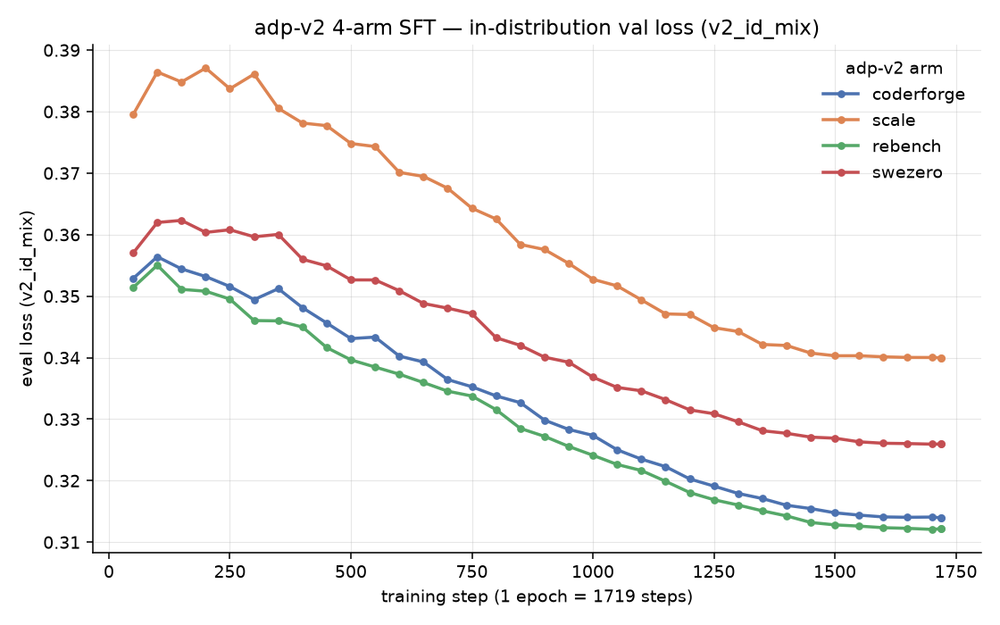
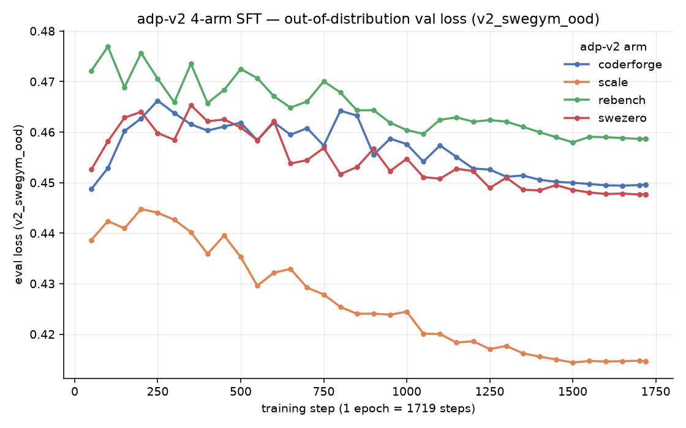

# adp-v2 4-arm SFT — A100 rerun report

*Compiled 2026-07-24 from the `v2_arms_a100_rerun` kit and the wandb project
`dfried/adp-v2-a100` (runs created 2026-07-23, all `finished`).*

## 1. What we did

Full-parameter supervised fine-tuning of **`Qwen/Qwen3.5-4B` (the *instruct* model, not
`-Base`)** on four different adp-v2 SWE data recipes — one training arm per data source,
**identical recipe, differing only in the training data**. This is the clean A100 rerun
of the Babel (CMU) campaign, whose original runs were confounded by learning-rate
schedule resets on preemption (fixed here with full-state checkpoints; see §6).

Purpose: a SWE-bench data-recipe sweep plus the headline **verification contrast**
(coderforge = resolution-verified vs swezero = unverified, both distilled from the same
Qwen3-Coder-480B teacher), feeding a downstream model-soup coefficient search over the
four task vectors.

> **Base-model note.** Earlier ADP "condenser" experiments used Qwen3.5 **base**
> checkpoints (`Qwen3.5-4B-Base`, `0.8B-Base`, `9B`, `35B-A3B`). This v2 campaign is
> different: it fine-tunes the **instruct** `Qwen/Qwen3.5-4B`. Confirmed from the run
> config (`model_name_or_path: Qwen/Qwen3.5-4B`, `model_type: qwen3_5`) and the run/dir
> naming (`v2_<arm>_inst_4b_a100`).

## 2. The four arms

All four pull from HF `neulab/adp-v2`, distilled agentic SWE trajectories in the
OpenHands SDK format:

| arm | adp-v2 config | teacher | resolution-verified? |
|---|---|---|---|
| **coderforge** | `coderforge_preview` | Qwen3-Coder-480B | yes |
| **scale** | `scale_swe_distilled` | DeepSeek v3.2 | yes |
| **rebench** | `nebius_SWE-rebench-openhands-trajectories` | Qwen3-Coder-480B | yes (+ regression tests) |
| **swezero** | `nvidia_SWE-Zero-openhands-trajectories` | Qwen3-Coder-480B | **no** |

## 3. Training data

- **Source & sampling:** per config, a deterministic 80k-record reservoir sample
  (seed 0) from `neulab/adp-v2`, converted to LLaMA-Factory **OpenAI tool-calling
  format** by the ADP `sft_to_llamafactory` adapter (kept in OpenAI format — *not*
  sharegpt — so the OpenHands SDK eval harness can parse it).
- **Records actually trained:** capped at **`max_samples: 55,000` per arm** at
  pre-tokenization.
- **Context length:** trajectories tokenized at **`cutoff_len: 32768`**, template
  **`qwen3_5_nothink`**.
- **Eval carve-outs (logged every 50 steps as `eval_<name>_loss`):**
  - **`v2_id_mix`** — an *in-distribution* validation mixture (held-out trajectories
    drawn from the same adp-v2 SWE families the arms train on).
  - **`v2_swegym_ood`** — an *out-of-distribution* held-out set (SWE-Gym), not part of
    any arm's training source, used as a generalization probe.

  Eval sets are baked into the tokenized cache at pre-tokenize time and are **identical
  across all four arms**, so the curves are directly comparable.

## 4. Training recipe (identical across all four arms)

| Setting | Value |
|---|---|
| Base model | `Qwen/Qwen3.5-4B` (instruct), full-parameter SFT |
| Template / format | `qwen3_5_nothink`, OpenAI tool-calling |
| Sequence length (`cutoff_len`) | 32768 |
| Samples / arm | 55,000 |
| Epochs | 1 → **1719 optimizer steps** |
| **Global batch** | **32** = 8 GPUs × `per_device_train_batch_size 1` × `gradient_accumulation_steps 4` |
| Peak LR | **1.0e-5** |
| LR schedule | **cosine** decay to ~0 (final LR ≈ 2.2e-10 — fully annealed) |
| Warmup | **`warmup_ratio: 0.03`** (~52 steps) |
| Precision | bf16 |
| Seed | 42 |
| Attention / kernels | FlashAttention-2, Liger kernel, `flash-linear-attention` + `causal-conv1d` (required — 24/32 Qwen3.5 layers are gated-delta-net) |
| Memory | gradient checkpointing on; DeepSpeed **ZeRO-2** |
| Checkpointing | `save_only_model: false` (full optimizer+scheduler state), `save_steps 100`, `save_total_limit 2` |
| In-training eval | `eval_steps 50`, `per_device_eval_batch_size 1`, `prediction_loss_only: true`, Liger `skip_logits` eval patch (avoids the 32k×~248k-vocab logits OOM) |

## 5. Hardware & wall-clock

- **Per arm:** 1 node × **8× NVIDIA A100 80 GB** (`ampere80gb`, NVLink), single-node
  8-GPU run (no special NCCL flags needed). ZeRO-2 keeps the 4B params replicated;
  peak memory sits comfortably under 80 GB/GPU.
- **All four arms ran in parallel** on 4 of the cluster's nodes.
- **Wall-clock per arm** (1 epoch, 1719 steps, incl. in-training eval):

  | arm | GPUs | wall-clock |
  |---|---|---|
  | coderforge | 8× A100-80GB | **14.6 h** |
  | rebench | 8× A100-80GB | **14.3 h** |
  | swezero | 8× A100-80GB | **13.8 h** |
  | scale | 8× A100-80GB | **13.6 h** |

  Campaign wall-clock ≈ **14.6 h** (arms run concurrently); aggregate ≈ **56 GPU-node-hours**
  ≈ **~460 A100-GPU-hours**.

## 6. LR-schedule integrity (why this is a rerun)

The original Babel arms used `save_only_model: true`, so every preemption resume
silently restarted a fresh warmup + full-length cosine from the resume step —
schedules were never matched across arms, and validation loss ended up dominated by
instantaneous LR state rather than data quality. This rerun bakes in the fix:
full-state checkpoints, a resume picker that hard-fails on model-only checkpoints, and
an identical cosine across arms by construction. **Verified clean here:** LR peaks at
1.0e-5 and anneals monotonically to ~2.2e-10 over exactly 1719 steps, one continuous
schedule per arm.

## 7. Results — training & validation loss

Final losses (step 1719):

| arm | final train loss | final `v2_id_mix` (ID) | final `v2_swegym_ood` (OOD) |
|---|---:|---:|---:|
| coderforge | 0.304 | 0.314 | 0.450 |
| scale | 0.284 | 0.340 | **0.415** |
| rebench | 0.313 | **0.312** | 0.459 |
| swezero | 0.315 | 0.326 | 0.448 |

### In-distribution validation loss (`v2_id_mix`)

All four arms decrease smoothly and monotonically after warmup. **rebench** and
**coderforge** reach the lowest ID loss (~0.312–0.314); **scale** is consistently
highest on the ID mixture (~0.340) — expected, since scale is the only arm distilled
from a different teacher (DeepSeek v3.2) and its distribution overlaps the ID mixture
least.

### Out-of-distribution validation loss (`v2_swegym_ood`)

The OOD story inverts. **scale** generalizes best to held-out SWE-Gym (0.439 → 0.415,
a clear downward trend), while the three Qwen3-Coder-480B-distilled arms stay nearly
flat (coderforge/swezero ~0.45, rebench worst at ~0.46) — they fit their own
distribution but transfer little to SWE-Gym. In other words, lowest ID loss
(rebench/coderforge) does **not** predict best OOD loss (scale) — a caution against
reading the ID curve as a proxy for generalization.

The headline **coderforge (verified) vs swezero (unverified)** contrast is small in
loss terms: swezero edges coderforge on both ID (0.326 vs 0.314 — coderforge lower)
and OOD (0.448 vs 0.450 — near-identical). Loss alone doesn't separate verified from
unverified distillation here; the SWE-bench resolution numbers (§8) are the real test.

## 8. SWE-bench Verified results — *placeholder*

> Downstream eval (500-instance SWE-bench Verified via the OpenHands SDK harness) is
> pending / to be run on the four `checkpoint-1719` models. The correct untrained
> baseline is the **instruct** `Qwen/Qwen3.5-4B` (same starting point as the arms) —
> to be measured. Legacy Babel anchors, for context only, were on *different* models:
> untrained **base** `Qwen3.5-4B-Base` **25/500**; paper-nonweb 24k SFT (base) **52/500**.

| model | resolved / 500 | % resolved | non-empty patch % | notes |
|---|---:|---:|---:|---|
| Qwen/Qwen3.5-4B (instruct, untrained) | _TBD_ | _TBD_ | _TBD_ | **the baseline** — same starting model as the arms |
| coderforge (verified) | _TBD_ | _TBD_ | _TBD_ | |
| scale (verified) | _TBD_ | _TBD_ | _TBD_ | |
| rebench (verified) | _TBD_ | _TBD_ | _TBD_ | |
| swezero (unverified) | _TBD_ | _TBD_ | _TBD_ | verification-contrast counterpart to coderforge |
| model soup (best coeff) | _TBD_ | _TBD_ | _TBD_ | from coefficient search over the 4 task vectors |

## 9. Provenance

- **wandb:** project `dfried/adp-v2-a100`; runs `adp-v2-{coderforge,scale,rebench,swezero}-4b-a100`
  (ids `2ngl029m`, `j99q3gzd`, `r1loirm2`, `bihafz14`), all `finished`, 2026-07-23.
- **Kit:** `openhands_sdk_training/v2_arms_a100_rerun/` (see `README.md` + `CLAUDE.md`
  for the full recipe rationale and integrity rules).
- **Plots:** `img/v2_id_mix_loss.png`, `img/v2_swegym_ood_loss.png`, regenerated from
  wandb history (eval loss vs. training step, 36 eval points/arm at `eval_steps 50`).
